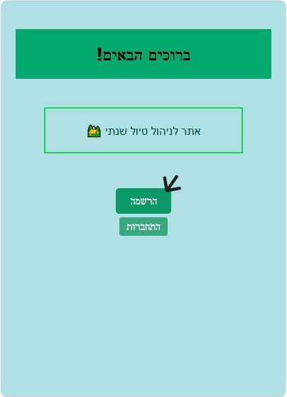
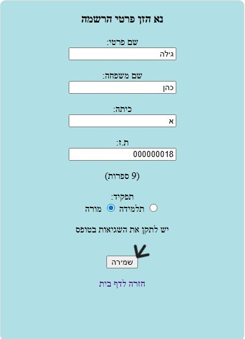
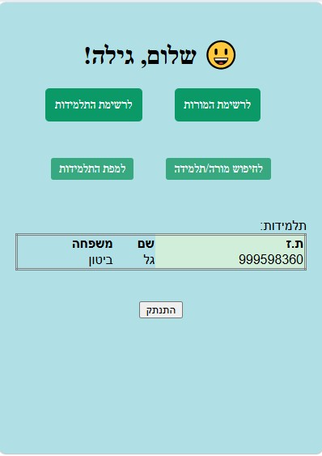
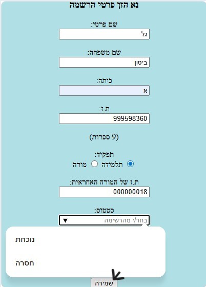
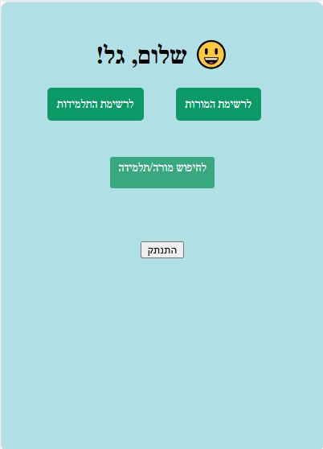
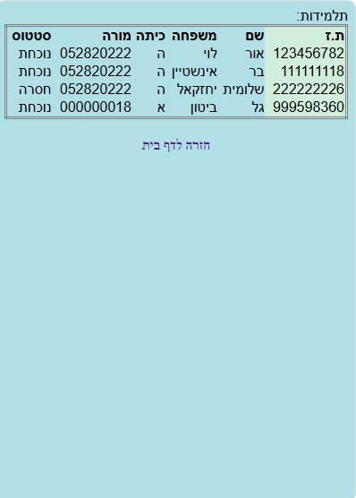
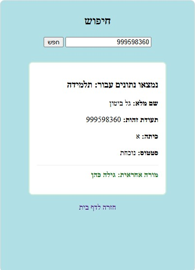
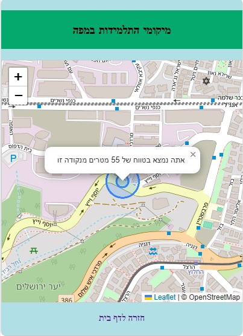
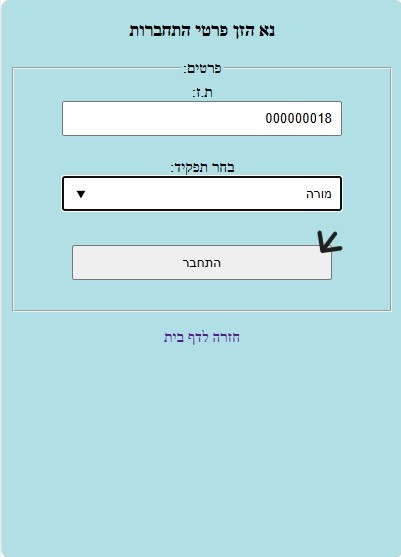

# מערכת לניהול טיול שנתי
**הסבר המערכת:** מערכת **ניהול טיול** פותחה כדי לספק פתרון טכנולוגי מתקדם לניהול לוגיסטי של טיולים שנתיים. המערכת מרכזת את כל המידע הנדרש למארגנים, מורים ומלווים בממשק אחד אינטואיטיבי, המשלב ניהול נתונים עם תצוגה גיאוגרפית חיה.

*מחברת:* אביטל טל.

קישור לאתר:  http://localhost:3000

**מדריך משתמש:**

> **ברוכים הבאים!** המדריך שלפניכם יעזור לכם לנווט בקלות במערכת, לנהל את רשימות המשתתפים ולעקוב בזמן אמת אחר מיקומים על המפה. הכל במקום אחד, חכם, מהיר ונגיש.

---

## מה יש במדריך:

* **מבוא:** מבוא ומטרות המערכת.
* **הגדרות:** הגדרות ותקנות לשימוש יעיל במערכת.
* **שימוש:** יצירת חשבון וכניסה לאתר.
* **תכונות ופונקציות עיקריות:** ניהול רשימות, מפה ומיקומים בזמן אמת, חיפוש חכם.
---

## מבוא ומטרות המערכת
אתר **ניהול טיול** מספק תמונת מצב מדויקת, מאובטחת וקבועה של כלל משתתפי הטיול בזמן אמת, מה שיעניק שקט נפשי למארגנים ולצוות המלווה במטרה להפוך את הטיול לחוויה בטוחה, מסודרת פשוטה ומהנה יותר.

> נגישות מיידית
צפייה בכל הנתונים מכל מכשיר, ללא צורך בהתקנה.

> אבטחת נתונים
צפייה במידע רשמי בלבד, המונעת שינויים לא מורשים או מחיקות בשטח.

> ריכוז מידע
כל השמות, השיוכים והקבוצות מסודרים ומחכים לכם בקליק אחד.

> מעקב חכם
שכבת מידע ויזואלית המציגה איפה כולם נמצאים ביחס למסלול.

**הערך המוסף שלנו (למה זה באמת עוזר?):**

כשיוצאים לשטח המערכת מניגישה נתונים מדויקים בקלות מבלי לאפשר טעויות אנוש:

- ריכוז נתונים חכם: היכולת לראות ברשימה אחת את כלל המערך (מורות ותלמידות) יחד עם המיקום הגיאוגרפי, נותנת פרספקטיבה רחבה שאי אפשר לקבל משום דף נייר.

- מקור מידע מהימן: מאחר והנתונים אינם ניתנים לשינוי בשטח, הצוות יכול לסמוך ב-100% שהמידע שהוא רואה הוא המידע הרשמי והמאושר שהוזן מראש. אין בלבול ואין טעויות של "מישהו מחק בטעות".

- איתור מהיר בחירום: במקום לחפש בקבוצות וואטסאפ או בטבלאות אקסל מסורבלות, המערכת מאפשרת שליפה מיידית של פרטי קשר ומשיוך קבוצתי. זמן התגובה מתקצר משמעותית.

- שקיפות מלאה לצוות: כל מורה מלווה רואה את אותה התמונה בדיוק כמו המארגן הראשי. זה יוצר שפה משותפת ומונע בלבול.

---
## הגדרות ותקנות

1.  **אימות וגישה:** השימוש במפה דורש חיבור פעיל לרשת האינטרנט ואישור דפדפן לגישה לשירותי מיקום.
2.  **תדירות עדכון:** נתוני המיקום נשלחים ומעובדים בפורמט JSON ומסונכרנים מול בסיס הנתונים אחת לדקה.
3.  **תאימות דפדפנים:** המערכת מותאמת לעבודה בדפדפנים מודרניים (Edge/Chrome). לביצועים מיטביים, יש לוודא כי "מצב תאימות IE" אינו פעיל.
4.  **פרטיות:** המידע המוצג במערכת נועד לצרכי ניהול הטיול בלבד. הגישה לנתוני המיקום מוגבלת לזמן הפעילות המבצעית של הטיול.

---

## שימוש

**הרשמה וכניסה לאתר**

כדי להשתמש בתכונות ופונקציונליות האתר יש להירשם לאתר על ידי הזנת פרטים. לדוגמא:

דף הבית:

**הרשמת מורה:** עלייך להזין פרטי הרשמה תוך מילוי פרטים תקינים בכל השדות:

דף הרשמה:

לאחר ההרשמה יוצג דף הבית של האתר עם הפרטים שהזנת:

דף בית לאחר הרשמת מורה:

**הרשמת תלמידה:**  עלייך להזין פרטי הרשמה תוך מילוי פרטים תקינים בכל השדות:

דף ההרשמה:

לאחר ההרשמה יוצג דף הבית של האתר עם הפרטים שהזנת:

דף בית לאחר הרשמת תלמידה:

## תכונות ופונקציות עיקריות:
**ניהול רשימות:** ניתן לצפות בקלות ברשימת המורות והתלמידות שנרשמו למערכת. (בנוסף מוצג למורות רשימת התלמידות מהכיתה שלהם בדף בית כפי שניתן לראות בדוגמא של דף הבית לאחר הרשמת מורה למערכת).

>כדי לגשת לרישמת המורות במערכת; יש ללחוץ על הכפתור "לרשימת המורות" מהדף בית.

הכפתור מהדף בית:

רשימת המורות:

>כדי לגשת לרשימת התלמידות במערכת; יש ללחוץ על הכפתור "לרשימת התלמידות" מהדף בית.

הכפתור מהדף בית:

 
רשימת התלמידות:

**חיפוש חכם:** ניתן לחפש מידע על מורה או תלמידה ספציפיות שנרשמו למערכת.

>לחיפוש מורה/תלממידה ספציפיות; יש ללחוץ על כפתור "לחיפוש מורה/תלמידה" שמוצג בדף בית.

הכפתור מהדף בית:

חיפוש:

תוצאת חיפוש:

**מפה ומיקומים בזמו אמת** כדי לוודא בקלות שכולם בטיול יש אפשרות למורות לראות את מיקומי התלמידות במפה ביחס למיקום שלהם.

>לתצוגת המפה ומיקומי התלמידות; יש ללחוץ על כפתור "למפת התלמידות" שמופיע בדף בית. (**הערה:** כדי לצפות בצורה מיבית ומדויקת יש לאשר לדפדפן לצפות במיום הנוכחי שלך).

הכפתור מדף הבית:

מפת התלמידות:

---
## שיפורים:
>לאחר הרשמה ראשונית תוכלי בפעמים הבאות הלתחבר בצורה פשוטה יותר למערכת מהדף בית, לדוגמא:

כפתור התחברות מדף הבית: 

הזנת פרטי התחברות:

ומיד לאחר ההתחברות תועברו לדף הבית שלכם.
---
## סיום:

מקווים שתמצאו את המערכת מועילה ונוחה לשימוש. טיול מוצלח לכולם!
---

**תוכנית לעתיד:** הטמעת השרת בענן לאספקת זמינות של 24/7 ללא תלות בתחנת עבודה מקומית.

פרטי קשר לתמיכה

  
